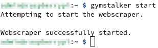
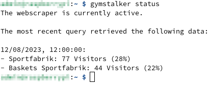
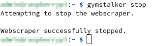
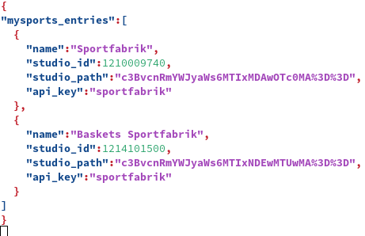
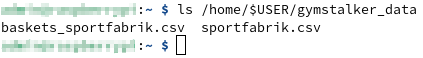

# Data collection for MySports.com

[MySports](https://www.mysports.com/) is a German fitness platform featuring several thousand gyms that use this platform to offer
their members various services. The website contains information about gyms such as
descriptions, pictures, opening hours, occupancy rates and visitor numbers.

This tool can be used to collect and store visitor numbers and occupancy rates of gyms over the long term.

By default, the application will collect visitor information for
[Sportfabrik Bonn-Beuel](https://www.mysports.com/studio/c3BvcnRmYWJyaWs6MTIxMDAwOTc0MA%3D%3D) and
[Sportfabrik Bonn-Hardtberg](https://www.mysports.com/studio/c3BvcnRmYWJyaWs6MTIxNDEwMTUwMA%3D%3D).
However, other fitness studios can also be configured.

## Instructions

### Commands

Start to collect data every 15 minutes (at hh:00:00, hh:15:00, hh:30:00 and hh:45:00):
```
gymstalker start
```


Display current status:
```
gymstalker status
```


Stop collecting data:
```
gymstalker stop
```


### Configuration

Configure fitness studios:
```
nano /home/$USER/.inwerk/apps/mysports-collector/config.json
```


### CSV files

The collected data is saved in CSV format:
```
ls /home/$USER/gymstalker_data
```


## How to install on Linux

Run the `install.sh` script to install the application.

```
curl -sSL https://raw.githubusercontent.com/inwerk/mysports-collector/main/install.sh | bash
```

## How to uninstall

Run the `uninstall.sh` script to remove the application from your system.

```
curl -sSL https://raw.githubusercontent.com/inwerk/mysports-collector/main/uninstall.sh | bash
```